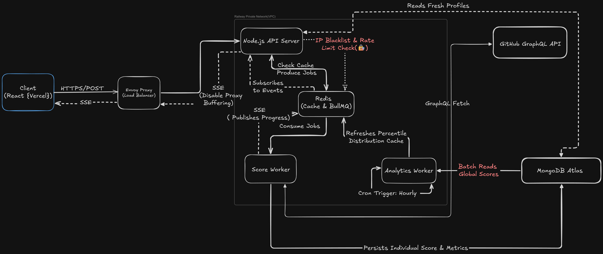

# GitKarma

**Turn a GitHub profile into a readable contribution score and percentile.**

GitKarma analyzes a developer's public GitHub activity—including commits, pull requests, repository stars, and followers—to calculate a GitKarma Score and, when a population distribution is available, a percentile ranking.

The application separates request handling from background score calculation. A React frontend communicates with a Node.js API, while BullMQ workers process expensive tasks asynchronously. Redis supports caching, queues, rate-limiting state, and job events; MongoDB stores score data used by the application and analytics pipeline.

> GitKarma is an independent project. A GitKarma Score is an application-defined metric, not an official GitHub rating or endorsement.

## Contents

- [Features](#features)
- [Architecture](#architecture)
- [Request lifecycle](#request-lifecycle)
- [Technology stack](#technology-stack)
- [Deployment](#deployment)
- [Local development](#local-development)
- [Configuration](#configuration)
- [API flow](#api-flow)
- [Operational notes](#operational-notes)
- [Contributing](#contributing)
- [License](#license)

## Features

- **GitHub profile scoring:** Calculates a score from selected public profile and contribution metrics.
- **Percentile ranking:** Compares a score with the stored GitKarma score distribution. The percentile can be unavailable until the analytics job has generated a distribution.
- **Asynchronous processing:** Uses BullMQ to move score calculation out of the request-response path.
- **Live progress:** Streams job progress to the browser using Server-Sent Events (SSE).
- **Multi-layer data retrieval:** Checks Redis first and can use recent MongoDB data as a fallback before starting a new GitHub fetch.
- **Abuse controls:** Uses Redis-backed IP rate limiting and a daily IP-based restriction for excessive profile requests.
- **Heuristic account screening:** Applies a rule-based activity heuristic to flag profiles that should not receive a score. This is a screening signal, not proof that an account is automated.
- **Separated workers:** Runs score calculation and hourly percentile analytics independently from the API service.

## Architecture

GitKarma is a distributed, event-driven application: its API and background workers run as separate services and coordinate through Redis-backed BullMQ infrastructure and shared data stores. The services are deployed in the same Railway project and communicate over Railway private networking where applicable.



### Service responsibilities

| Component | Responsibility |
|---|---|
| **Frontend (Vercel)** | Provides the profile input and score views. It submits requests to the API and listens for job updates through the browser's `EventSource` API. |
| **Public ingress / proxy (Railway)** | Accepts public HTTPS traffic and forwards it to the API service. The API must be configured to interpret forwarded client IP information only from trusted proxies. |
| **API server (Railway)** | Validates incoming requests, applies abuse controls, checks cached or recent data, enqueues score jobs when needed, and exposes the SSE progress endpoint. |
| **Redis** | Holds short-lived response-cache entries and rate-limit state, and provides the Redis infrastructure used by BullMQ. |
| **BullMQ** | Manages queued score jobs and exposes job lifecycle events through `QueueEvents`. BullMQ's queue events use Redis Streams; they are not ordinary Redis Pub/Sub messages. |
| **Score worker (Railway)** | Consumes score jobs, fetches data from GitHub GraphQL, applies the configured account heuristic, calculates the score, and persists the result. |
| **Analytics worker (Railway)** | Runs the scheduled percentile calculation, aggregates stored scores, and writes the resulting distribution to Redis for lookup. |
| **MongoDB Atlas** | Persists user score information and metric snapshots used by the application and analytics worker. |

## Request lifecycle

### 1. A score is requested

The frontend sends a request to `POST /api/user/getInfo` with a GitHub username. The API validates the input and applies the configured IP-based protections.

### 2. The API checks available data

The API follows the configured data-retrieval policy:

1. Check Redis for a cached score response.
2. If the cache does not contain a usable entry, check MongoDB for a sufficiently recent score (the current freshness policy is under eight hours).
3. If usable data is found in MongoDB, return it and repopulate the cache as appropriate.
4. If no usable result is available, enqueue a score job in BullMQ.

### 3. The API responds without waiting for the worker

When a new calculation is queued, the API returns **HTTP `202 Accepted`**. This means the request was accepted for asynchronous processing; it does **not** mean the score is ready.

When a usable score is already available, the API can return it immediately with **HTTP `200 OK`**.

### 4. The worker calculates the score

The score worker consumes the queued job, queries GitHub's GraphQL API, aggregates the selected metrics, applies the configured account-screening heuristic, and calculates the GitKarma Score. Successful results are persisted in MongoDB and written to the Redis response cache.

### 5. The browser receives progress over SSE

The frontend opens an SSE connection to the API's progress endpoint. The API listens to BullMQ job events and forwards progress and terminal events to the browser. The browser can then fetch and display the completed score.

SSE is a unidirectional stream from server to browser. It is separate from the initial HTTP request that creates or retrieves the score.

### 6. Percentile analytics run separately

The analytics worker runs on an hourly schedule, calculates the score distribution from persisted data, and stores the result in Redis. A percentile may be `null` when the distribution is not yet available; the frontend should present that as pending or unavailable rather than as a numeric zero.

## Technology stack

| Layer | Technologies |
|---|---|
| Frontend | React, TypeScript, Vite, Tailwind CSS, Redux Toolkit, Axios, browser `EventSource` |
| API | Node.js, TypeScript, Express |
| Background jobs | BullMQ |
| Redis client | ioredis |
| Persistence | MongoDB Atlas, Mongoose |
| External data | GitHub GraphQL API |
| Frontend hosting | Vercel |
| Backend hosting | Railway services and private networking |

## Deployment

The production application is split into independently deployed services:

- **Frontend:** Vercel
- **API:** Railway
- **Score worker:** Railway
- **Analytics worker:** Railway
- **Redis:** Railway, with persistent volume configured for the Redis deployment
- **Database:** MongoDB Atlas

The API and workers can be deployed and scaled independently. Internal service communication uses Railway private networking rather than requiring public URLs for internal traffic.

A Redis persistent volume helps preserve Redis data across service restarts, but it does not replace backups, monitoring, or a recovery plan. Redis remains a dependency for queue processing and the configured rate limiter, so production behavior during Redis outages should be explicitly tested.

## Local development

### Prerequisites

- Node.js version supported by the project (use the version specified by the repository or deployment configuration).
- npm.
- A reachable MongoDB instance.
- A reachable Redis instance.
- A GitHub Personal Access Token (PAT) with the permissions required by the GraphQL query.

### 1. Clone the repository

Replace the placeholder with the repository's actual GitHub URL.

```bash
git clone https://github.com/<your-username>/gitkarma.git
cd gitkarma
```

### 2. Install dependencies

Install the backend dependencies from the repository root:

```bash
npm install
```

Install the frontend dependencies:

```bash
cd client
npm install
cd ..
```

### 3. Configure environment variables

Create a `.env` file in the backend project root:

```dotenv
# API server
PORT=5000
NODE_ENV=development
FRONTEND_URL=http://localhost:5173

# Data stores
DB_PASSWORD="Your MongoDB Password"
REDIS_URL=redis://127.0.0.1:6379

# GitHub GraphQL integration
GITHUB_PAT=replace_with_your_github_token
```

Create `client/.env`:

```dotenv
VITE_BACKEND_URL=http://localhost:5000
```

Use your actual MongoDB and Redis connection strings if they are not running locally. Never commit `.env` files, access tokens, or production credentials to source control. Only variables prefixed with `VITE_` should be treated as frontend-exposed values; never put secrets in them.

### 4. Start the services

Run each service in a separate terminal. These commands assume the corresponding scripts are present in the root `package.json`.

**Terminal 1 — API server**

```bash
cd server
npm run dev
```

**Terminal 2 — Score worker**

```bash
cd server
npm run worker:score
```

**Terminal 3 — Analytics worker**

```bash
cd server
npm run worker:analytics
```

**Terminal 4 — Frontend**

```bash
cd client
npm run dev
```

Open the local URL printed by Vite (typically `http://localhost:5173`). Ensure MongoDB and Redis are reachable before starting the backend services.

## Configuration

| Variable | Used by | Description |
|---|---|---|
| `PORT` | Backend | Port on which the API listens locally. The hosting platform may provide its own port configuration. |
| `NODE_ENV` | Backend | Runtime environment, such as `development` or `production`. |
| `FRONTEND_URL` | Backend | Frontend origin used by the backend's CORS configuration, if configured there. |
| `DB_PASSWORD` | Backend / workers | MongoDB Password. |
| `REDIS_URL` | Backend / workers | Redis connection string. |
| `GITHUB_PAT` | Score worker | Server-side token used for GitHub GraphQL requests. Keep it secret. |
| `VITE_BACKEND_URL` | Frontend | Public base URL of the backend API. This value is bundled into the frontend build and must not contain secrets. |

## API flow

| Method | Endpoint | Purpose |
|---|---|---|
| `POST` | `/api/user/getInfo` | Retrieve an available score or enqueue score calculation. |
| `GET` | `/api/user/progress/:jobId` | Open an SSE connection for job progress and terminal status. |

For an asynchronous score request, the frontend uses the job ID associated with the username to subscribe to the progress endpoint. The exact response fields and error payloads are defined by the API implementation.

## Operational notes

- **Rate limiting:** Keep the rate limiter on the server. A Redis-backed store allows API instances to share rate-limit state; the client should render the API's limit response rather than enforce the policy itself.
- **Client IP handling:** Configure Express proxy trust to match the actual Railway ingress path. Do not blindly trust arbitrary client-supplied `X-Forwarded-For` values, since incorrect IP extraction can undermine IP-based controls.
- **SSE delivery:** Use `Content-Type: text/event-stream`, disable response buffering for the SSE route, and avoid compression middleware buffering on that route. Flush headers when opening the stream and close listeners when the client disconnects or the job reaches a terminal state.
- **Job failures:** Distinguish an intentionally rejected profile from a failed job. A rejection is a business outcome; a network, database, or GitHub API error is an operational failure.
- **Redis availability:** Redis is used for multiple responsibilities. Test behavior when Redis is unavailable, including rate-limit handling, queue processing, cache misses, and recovery after reconnecting.
- **Percentile availability:** Do not display a missing percentile as `0`. It can be unavailable until the analytics worker has produced a current score distribution.
- **GitHub API limits:** Cache and deduplicate work where possible, monitor GitHub rate-limit information, and avoid retrying permanent errors such as an invalid username.

## Contributing

Issues, bug reports, and pull requests are welcome. For substantial changes, open an issue first to discuss the proposed behavior or design.

When submitting a pull request, include a concise description of the change and relevant test results. Never include tokens, credentials, or private user data in commits or issue reports.

## License

GitKarma is licensed under the MIT License. See the [`LICENSE`](LICENSE) file for the full license text.
